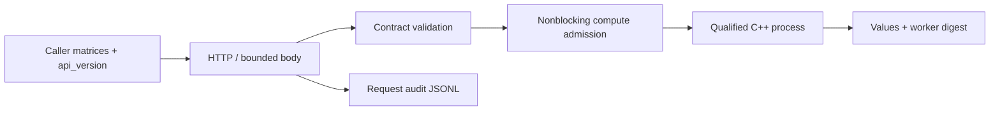

# Workload Integration Clinic

[](https://github.com/JDinSeattle/workload-integration-clinic/actions/workflows/ci.yml)

A deployable reference integration for the qualified CPU GEMM worker from [project A](https://github.com/JDinSeattle/qualification-regression-kit). The service accepts actual matrix values over HTTP, enforces version/shape/finite-value limits, bounds compute concurrency, returns business results and records the worker digest.

Two configurations (`compact`: one worker, dimensions ≤128; `throughput`: four workers, dimensions ≤256) have an executable migration and rollback test. Capacity evidence covers six cohorts, each with 48 HTTP requests, retaining successful latency and explicit overload rejection separately. Five injected failures exercise version, resource, input, executable permission and worker deadline handling.

The first load test exposed a real integration defect: closing an overloaded connection before reading its request body caused TCP resets. The fix bounds connection handlers separately and decides compute admission after reading a bounded body. The original failure is retained in `docs/failures/`. Native gprof profiles and paired kernel timings explain the row-loop optimization; HTTP latency includes parsing, serialization and process startup.

## September 2026 maintenance

A reproduced path-replacement bug returned changed computation bytes with the original startup digest. Startup now reads the executable once into a sealed Linux memfd, hashes those bytes, checks its version and runs only that descriptor. Admission and accepted/completed/failed counters share a condition lock. /live, /ready and /metrics expose lifecycle state. SIGTERM/SIGINT reject new work, drain accepted requests up to a deadline, then kill worker process groups and reap children. Actual HTTP tests cover graceful and forced drain, CLI SIGTERM, malformed workers and executable replacement.

[Design, acceptance tests and limits](docs/refresh-20260907.md) · [Current measured results](docs/refresh-results-20260907.md). CI repeats validation on Python 3.12 and 3.14.7.

## Reproduce

```bash
git clone https://github.com/JDinSeattle/workload-integration-clinic.git
cd workload-integration-clinic
make verify
python3 evidence.py .runs/latest
```

`make test` runs focused contract regressions. `make verify` also builds and executes real integration/fault experiments. A prior `.runs/latest` is moved to a timestamped archive before a fresh run; nonempty output directories outside `.runs` are never overwritten. GitHub Actions executes the same entry point and uploads evidence even on failure.

The checked-in [local evidence](evidence/local/) has raw records, a source/environment manifest and SHA-256 artifact hashes. Verify it with `make evidence-check`. [Measured results](docs/results.md), [engineering notes](docs/engineering.md), and [interview guide](docs/interview.md) explain what can be claimed.

## System



The operator is a checksum-pinned vendored dependency with license and source provenance; there is one service implementation, here. Installation compiles into this repository's `build/`, uses an atomic target replacement and never modifies global Python or system packages. The author performs migration by draining/stopping one local server then starting the other configuration: this is a tested rollback path with downtime, not a rolling zero-downtime claim.

## Support and evidence limits

Linux x86_64, Python ≥3.10, g++. Loopback-only reference service using Python stdlib HTTP; 32 connection-handler ceiling, configured compute slots, 1 MiB request body, 3 s socket timeout, 2 s worker deadline. Overloads beyond the connection ceiling may end at the transport layer; validated offered concurrency is ≤8. No internet-facing TLS/AuthN, Kubernetes rollout, GPU inference or actual external customer. Load generation is closed-loop, not a fixed-arrival-rate service-level capacity study. At least one successful response is required per cohort; rejected requests remain in the denominator. The reference implementation does not claim production availability or fleet-scale capacity.


**Role evidence:** Developer technology · solutions engineering. This is an author-operated engineering lab. AI-assisted implementation is disclosed; ownership means understanding, reproducing and explaining the code and measurements. No external customer, production operation, upstream contribution or independent reviewer is implied.

MIT licensed. Operator source vendoring, where present, is recorded in `vendor/lock.json`; upstream workload attribution, where present, is in `upstream/`.
