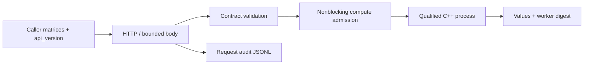

# Engineering contract

The operator is a checksum-pinned vendored dependency with license and source provenance; there is one service implementation, here. Installation compiles into this repository's `build/`, uses an atomic target replacement and never modifies global Python or system packages. The author performs migration by draining/stopping one local server then starting the other configuration: this is a tested rollback path with downtime, not a rolling zero-downtime claim.

## Compatibility and limits

Linux x86_64, Python ≥3.10, g++. Loopback-only reference service using Python stdlib HTTP; 32 connection-handler ceiling, configured compute slots, 1 MiB request body, 3 s socket timeout, 2 s worker deadline. Overloads beyond the connection ceiling may end at the transport layer; validated offered concurrency is ≤8. No internet-facing TLS/AuthN, Kubernetes rollout, GPU inference or actual external customer. Load generation is closed-loop, not a fixed-arrival-rate service-level capacity study. At least one successful response is required per cohort; rejected requests remain in the denominator. The reference implementation does not claim production availability or fleet-scale capacity.

